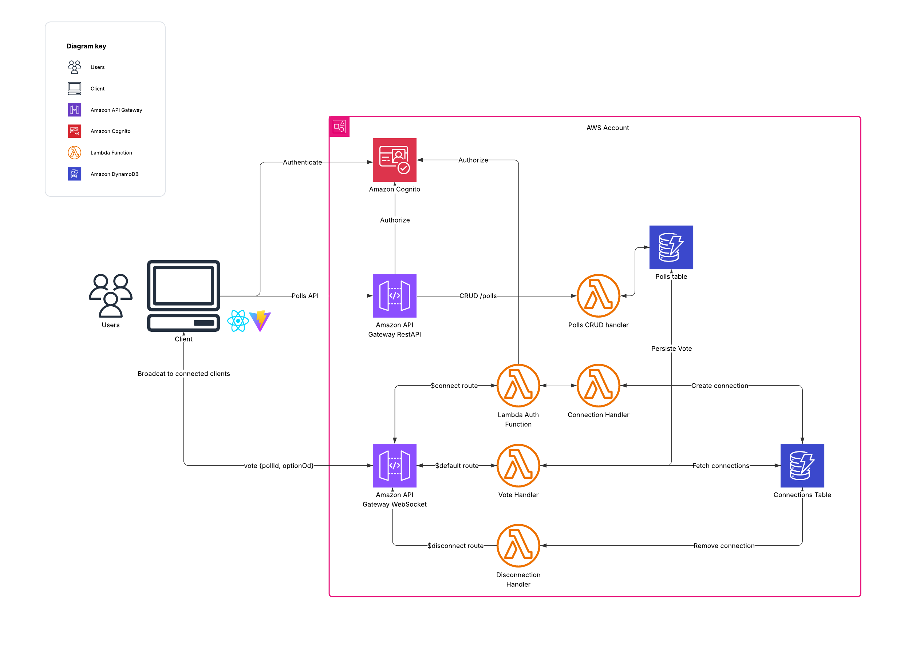

# Polling App – Backend

This is the **serverless backend** for the Polling App.  
It is built using **AWS Lambda**, **DynamoDB**, and **API Gateway**, and deployed using **AWS CDK (TypeScript)**.

The backend supports:
- REST APIs for poll management  
- WebSocket APIs for real-time voting updates  
- Authentication via **Amazon Cognito**  

---
## Architecture


## 🚀 Prerequisites

Before running or deploying the backend, make sure you have:

1. An **AWS account**.  
2. [AWS CLI](https://aws.amazon.com/cli/) installed and configured with a default profile that has permissions to create resources.  
3. An **Amazon Cognito User Pool** created (to be used for authentication).  

---

## ⚙️ Environment Variables

Create a `.env` file at the root of the backend project with the following variables:

```env
COGNITO_USER_POOL_ID=
FRONTEND_URL=
FRONTEND_URL_LOCAL=http://localhost:5173/
```
## Install & Deploy

### Install dependencies:

```bash
npm install
```


### Deploy the backend using AWS CDK:

```bash
cdk deploy
```


CDK will create all necessary resources: Lambda functions, API Gateway (REST + WebSocket), DynamoDB tables, and IAM roles.